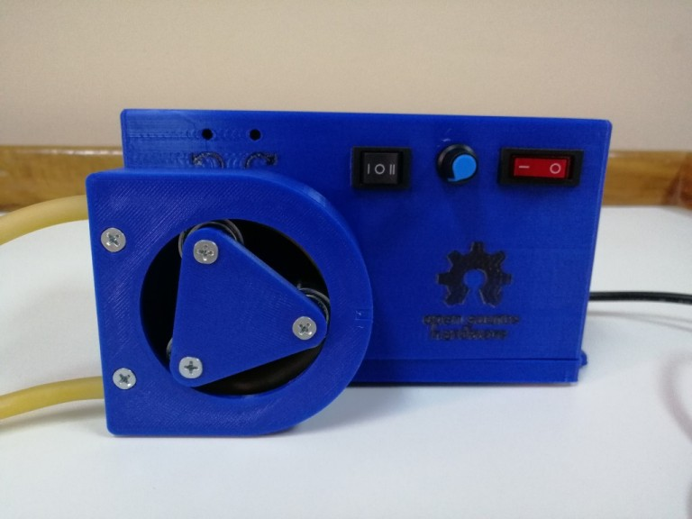

# Bomba Peristáltico | Peristaltic Pump

#### Español
* * * 
Este proyecto surge de la necesidad de una bomba peristáltica para recircular agua en un circuito cerrado de refrigeración en un laboratorio de química. En este caso, se usa para enfriar el condensador de un evaporador rotativo. Puedes ver la [documentación]() del proyecto y acceder a los planos y modelos 3D.

Cuando necesité comprar una bomba peristaltica, querian cobrarme USD 5.000.- (Si, no tenia sentido pagar 5000 dolares). Aprendí a dibujar en 3D usando [FreeCAD](https://www.freecad.org/) gracias a unos excelentes tutoriales en YouTube de [Obijuan](https://www.youtube.com/@ObijuanCube). Hice esta bomba peristaltica por un costo aproximado de USD 20.-

#### English
* * * 
_This project arises from the need for a peristaltic pump to recirculate water in a closed cooling circuit in a chemistry laboratory. In this case, it is used to cool the condenser of a rotary evaporator. See the [documentation]() of the project and access to sketch and 3D models._

_When I needed to buy a peristaltic pump, they wanted to charge me USD 5,000.- (Yes, it made no sense to pay 5,000 dollars). I learned to draw in 3D using [FreeCAD](https://www.freecad.org/) thanks to some excellent tutorials on YouTube by [Obijuan](https://www.youtube.com/@ObijuanCube). I made this peristaltic pump by aprox USD 20._ 

